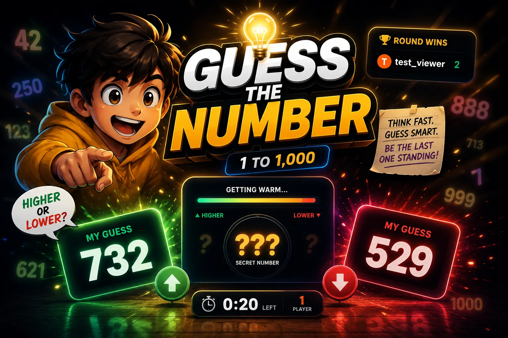
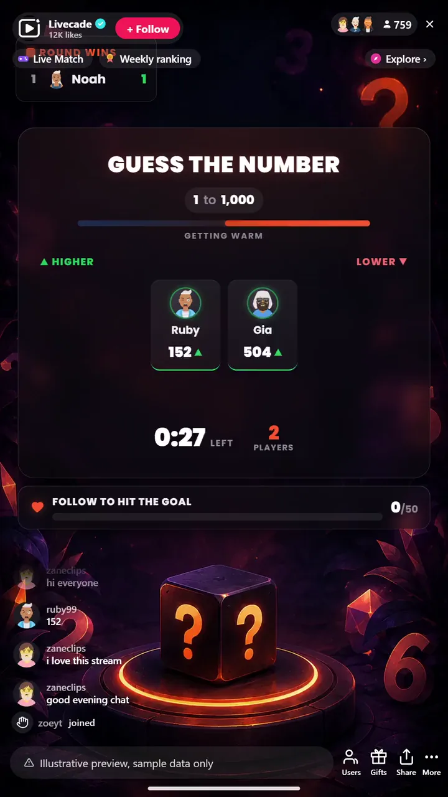

# Guess the Number - Interactive TikTok Live Game

> A hidden number and your whole chat racing to get closest.

A hidden number, a live countdown, and your whole chat racing to get closest. Viewers comment guesses, the overlay shows higher or lower as they close in, and the nearest guess wins the round. A follower goal turns every round into growth.

**[Play Guess the Number on Livecade](https://livecade.io/games/guess-the-number/?utm_source=github&utm_medium=readme&utm_campaign=guess-the-number)** - runs as a single browser source in OBS, Streamlabs, or TikTok LIVE Studio. Nothing for viewers to install.

## How viewers play

Viewers take part with the actions TikTok already gives them: **comments**. Every action below is rebindable, so you decide which interaction drives which effect.

## How it works

### Type a number to play

A secret target is set each round. Viewers just type a number in your TikTok Live chat, the easiest game your audience will ever join.

### Higher or lower closes in

Every guess shows on screen with the viewer's avatar, and live higher-or-lower feedback shrinks the range as the crowd gets warmer.

### Closest guess wins

When the timer ends the nearest guess wins the round, or switch to first-exact-match for instant wins. A round-wins board gives the session an arc.

## About the game

Guess the Number is the easiest game your audience will ever join: type a number in chat, that is it. A secret target is set each round, random or picked by you for themed rounds like guess my age.

### The crowd can feel itself getting warmer

A live shrinking range narrows with higher and lower feedback on every guess. Closest guess when the timer ends wins, or switch to first-exact-match for instant wins.

### Every guesser gets a moment

Guessers show up on screen with their avatar, a suspense beat builds before the reveal, and the closest runners-up are named too. A round-wins leaderboard gives the session an arc, and a built-in follower goal makes each round pull new follows.

## What it looks like on stream

[Watch Guess the Number gameplay](https://cdn.livecade.io/games/guess-the-number.mp4)

## What you can configure

- **Interface language** - Twelve languages for the on-screen chrome
- **Target source** - Random each round, or you set it for themed rounds like "guess my age"
- **Range** - The minimum and maximum the target can fall between
- **Win rule** - Closest guess when time runs out, or first exact match
- **Round time and guesses per viewer** - How long a round runs and how many tries each viewer gets
- **Higher or lower feedback** - Show warmer-colder hints as guesses come in
- **Auto-advance** - Roll into the next round automatically, with a gap you set
- **Round-winners leaderboard** - Show a live board of round wins, and how many entries
- **Follower goal** - A live follow target that makes each round pull new follows
- **Read winner aloud** - Text-to-speech announcement of the round winner
- **Background** - Transparent, a solid color, or your own image

## Languages

English, Spanish, Portuguese, French, German, Italian, Indonesian, Arabic, Turkish, Russian, Hindi, Romanian

## FAQ

<strong>How do viewers play Guess the Number?</strong>

Viewers type a number in your TikTok Live chat, that is the whole game. Live higher-or-lower feedback shows the crowd getting closer until the timer ends.

<strong>Can I set the target myself?</strong>

Yes. Leave it random for a normal round, or set it yourself for themed rounds like "guess my age" or "guess the follower count".

<strong>How does it help me grow?</strong>

A built-in follower goal turns every round into a growth moment, and the round-wins leaderboard keeps regulars coming back across a session.

<strong>How do I add Guess the Number to my TikTok Live?</strong>

Add one browser source URL to OBS or your streaming software and go live. There is no plugin to install and nothing for your viewers to download.

## Setup

1. [Create a Livecade account](https://app.livecade.io/register?utm_source=github&utm_medium=cta&utm_campaign=guess-the-number)
2. Copy your overlay browser source URL
3. Paste it into OBS, Streamlabs, or TikTok LIVE Studio
4. Pick Guess the Number, set your triggers, and go live

Runs in the browser, so it works on Windows and macOS with nothing to download. [See all TikTok Live games](https://livecade.io/tiktok-live-games/?utm_source=github&utm_medium=readme&utm_campaign=guess-the-number).

---

_This repository documents Guess the Number, a hosted interactive game by [Livecade](https://livecade.io/?utm_source=github&utm_medium=footer&utm_campaign=guess-the-number). The game runs on Livecade's platform, so there is no source to install here._
